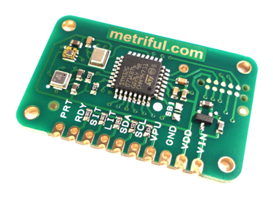

# The Metriful Sensor Module

<!-- PLEASE NOTE: this document is formatted in Markdown and should be read using a suitable viewer -->



[**Support the Kickstarter campaign**](https://www.kickstarter.com/projects/metriful/sense-indoor-environment-monitor)

Metriful is a low power, high accuracy, smart sensor cluster for indoor environment monitoring. It is operated via a simple I2C-compatible interface and measures eighteen variables including air quality, light and sound levels.

This repository provides setup instructions and software examples for running Metriful with Arduino and Raspberry Pi host systems. The documentation and code are also useful starting points for system development with other microcontrollers.

The code examples are simple procedural programs which show various ways of using the Metriful module. This includes basic control and readout, as well as saving data to files and to IoT cloud storage. Detailed code comments explain each part of the programs.

This readme provides a quick start for running the example programs on Arduino and Raspberry Pi.

The [**User Guide**](User_guide.pdf) covers hardware setup, gives an overview of the code examples and explains more about what Metriful measures. 

The [**Datasheet**](Datasheet.pdf) is a detailed specification of the electrical and communications interfaces of the Metriful board. 

You can also [visit the product homepage.](https://www.sensor.metriful.com)

### Contents
**[Use with Arduino](#use-with-arduino)**<br>
**[Use with Raspberry Pi](#use-with-raspberry-pi)**<br>
**[IoT cloud setup](#iot-cloud-setup)**<br>
**[License](#license)**<br>
**[Disclaimer](#disclaimer)**<br>


## Use with Arduino

All code examples in the Arduino folder work on the Arduino Nano 33 IoT, while those not requiring a network connection also work on Arduino Uno. 

### First time Arduino setup

Note that steps 1 and 2 are already complete if you have used Arduino before on your computer.

1. Download and install the [Arduino IDE](https://www.arduino.cc/en/main/software) on your computer.
2. Start the Arduino IDE for the first time. This will create a folder named **Arduino/libraries** in your user area (e.g. in the Documents folder on Windows computers).
3. Download and unzip the [Sensor repository](https://www.github.com/metriful/sensor). From this, copy the folder **Metriful_Sensor** (located within the Arduino folder) into the Arduino libraries folder in your user area.

If using **Arduino Nano 33 IoT**, also do the following:

4. Download and install the SAMD board package: in the Arduino IDE menu, go to Tools > Board > Boards Manager (top of list). Search for and install **Arduino SAMD Boards (32-bits ARM Cortex-M0+)**
5. Install the WiFiNINA package: in the Arduino IDE menu, go to Tools > Manage Libraries. Search for and install **WiFiNINA**.
6. Download the [SlowSoftWire library](https://github.com/felias-fogg/SlowSoftWire). Unzip it and move it into the Arduino libraries folder in your user area.
7. Download the [SlowSoftI2CMaster library](https://github.com/felias-fogg/SlowSoftI2CMaster). Unzip it and move it into the Arduino libraries folder in your user area.

### Wiring for Arduino Uno

| Arduino Uno pin name | Metriful pin label |
|:--------------------:|:---------------:|
|       5V             |        VIN      |
|       GND            |        GND      |
|       5V             |        VPU      |
|       SCL            |        SCL      |
|       SDA            |        SDA      |
|     Digital pin 4    |        LIT      |
|     Digital pin 7    |        SIT      |
|     Digital pin 2    |        RDY      |

* Metriful board input **VDD** is not used with the Arduino Uno.
* If also using the PPD42 particle sensor, connect:
	* Arduino Uno 5V pin to PPD42 pin 3
	* Arduino Uno GND pin to PPD42 pin 1
	* PPD42 pin 4 to Metriful pin PRT

### Wiring for Arduino Nano 33 IoT

| Arduino Nano 33 IoT pin name | Metriful pin label |
|:----------------------------:|:---------------:|
|          3.3V                |        VDD      |
|          GND                 |        GND      |
|          3.3V                |        VPU      |
|          A3                  |        SCL      |
|          A0                  |        SDA      |
|          A1                  |        LIT      |
|          A2                  |        SIT      |
|          D13                 |        RDY      |

* Metriful board input **VIN** is not used with the Arduino Nano 33 IoT.
* If also using the PPD42 particle sensor:
	* The solder bridge labeled “VUSB” on the underside of the Arduino must be soldered closed (to provide 5V from the USB cable to the PPD42 via the VUSB pin).
	* Connect Arduino pin 27 (VUSB) to PPD42 pin 3
	* Connect Arduino pin 29 (GND) to PPD42 pin 1
	* Connect PPD42 pin 4 to Metriful pin PRT

### To run an example Arduino program:

1. Wire the Metriful board to the Arduino (Uno or Nano 33 IoT) as described in the previous section.
2. Plug the Arduino into your computer via USB.
3. Start the Arduino IDE and open the chosen example code file, e.g. **simple_read_sound.ino**
4. In the Arduino IDE menu, go to Tools > Port and select the port with the Arduino attached.
5. Go to Tools > Board and select the Arduino model (Uno or Nano 33 IoT).
6. Select Sketch > Upload and wait for upload confirmation.
7. Go to Tools > Serial Monitor to view the output (ensure **9600 baud** is selected in the monitor).

## Use with Raspberry Pi

The example programs for Raspberry Pi use Python 3 and are provided in the **Raspberry_Pi** folder.

### First time Raspberry Pi setup

This setup assumes that you are using Raspbian Buster, which comes with all required Python packages already installed (the packages used are: **RPi.GPIO**, **smbus** and **requests**).

1. Enable I2C on your Raspberry Pi using the raspi-config utility by opening a terminal and running:
	```
	sudo raspi-config
	```
	Select **5 Interfacing Options** and then **P5 I2C**. A prompt will appear asking "Would you like the ARM I2C interface to be enabled?": select **Yes** and then exit the utility.
2. Shut-down the Raspberry Pi and disconnect the power. Wire up the hardware as described in the following section. Double-check the wiring then restart the Pi.
3. Check that the Metriful board can be detected by running: 
	```
	sudo i2cdetect -y 1
	```
	This should report the 7-bit address number **71**.
4. Download and unzip the [Sensor repository](https://www.github.com/metriful/sensor). The Raspberry Pi examples are found within the folder named **Raspberry_Pi**.

### Wiring for Raspberry Pi

| Raspberry Pi pin number | Raspberry Pi pin name | Metriful pin label |
|:-----------------------:|:---------------------:|:---------------:|
|          1              |      3V3 power        |        VDD      |
|          6              |        Ground         |        GND      |
|          17             |      3V3 power        |        VPU      |
|          5              |      GPIO 3 (SCL)     |        SCL      |
|          3              |      GPIO 2 (SDA)     |        SDA      |
|          7              |        GPIO 4         |        LIT      |
|          8              |        GPIO 14        |        SIT      |
|          11             |        GPIO 17        |        RDY      |

* Metriful board input **VIN** is not used with the Raspberry Pi.
* If also using the PPD42 particle sensor, connect:
	* Pi pin 2 (5V) to PPD42 pin 3
	* Pi pin 9 (Ground) to PPD42 pin 1
	* PPD42 pin 4 to Metriful pin PRT

### To run an example Raspberry Pi program:

1. Wire the Metriful board to the Pi as described in the previous section.
2. Open a terminal and change to the code examples folder **Raspberry_Pi**. 
3. Run one of the example programs using Python 3:
	```
	python3 simple_read_sound.py
	```

## IoT cloud setup

The **IoT_cloud_logging** code example shows how to send data to an Internet of Things (IoT) cloud storage account. It is provided for both Arduino and Raspberry Pi systems.

IoT cloud hosting is available from many providers around the world. Some offer free accounts (with storage or access limits) for non-commercial purposes. The IoT cloud logging example gives a choice of two providers, [Tago.io](https://tago.io) and [Thingspeak.com](https://thingspeak.com). The following sections give a brief overview of how to set up free accounts with these providers: for further information see the relevant provider website.

### Tago cloud

An example of Metriful data logging with the Tago cloud can be viewed publicly here:

[https://admin.tago.io/public/dashboard/5e21a4f806fbee0026eb48c8/07c2e906-f806-4e30-adcd-0ca2919d9828](https://admin.tago.io/public/dashboard/5e21a4f806fbee0026eb48c8/07c2e906-f806-4e30-adcd-0ca2919d9828)

The steps required to set up Tago for the IoT cloud logging code example are:

1. Register for a free account at [Tago.io](https://tago.io)
2. In the **Devices** menu, click **Add Device**.
3. Select **Custom HTTPS** (HTTP) as the device type.
4. Choose a device name (e.g. Indoor Environment Monitor) and click **Create device**
5. On the **General Information** tab of the new device, in the section **Token & Serial Number**, click the eye icon to reveal the token (a long sequence of letters, numbers and hyphens). Copy this token.
6. Paste the token into the Metriful IoT cloud logging example code as the variable **TAGO_DEVICE_TOKEN_STRING** and set the variable **useTagoCloud** as **true**.
7. Run the Metriful IoT cloud logging example code on the chosen system (Raspberry Pi or Arduino Nano 33 IoT) for a few minutes to ensure at least one set of data has been logged.
8. Verify that data are being stored in the Tago cloud by viewing the bucket’s **Variables** tab. This should show the following short names for the environment data variables:
	* **temperature**
	* **pressure**
	* **humidity**
	* **aqi** (air quality index, AQI)
	* **aqi_string** (a text interpretation of the AQI)
	* **bvoc** (equivalent breath VOC concentration)
	* **spl** (the A-weighted Sound Pressure Level)
	* **peak_amp** (the peak sound amplitude)
	* **illuminance**
	* **particulates** (air particle concentration)
9. Create a Tago dashboard for viewing the data: click the **+** to add a new dashboard, choose its name and click **save**.
10. Add widgets of various types to the dashboard (e.g. **Line** for a simple graph, **Card** to display text or numbers). The minimum configuration for each widget is to choose the **Variable** which it displays. It is also possible to edit graph and axis titles, coloring, calculate formulas, etc.
11. To set graph time periods to 24 hours: on the **Data Range & Format** tab of the chart settings, input **864** as the **maximum number of points to be displayed**. This assumes that the data are logged every 100 seconds (there are 86,400 seconds in 24 hours).


### Thingspeak cloud

An example of Metriful data logging with the Thingspeak cloud can be viewed publicly here: 

[https://thingspeak.com/channels/1014791](https://thingspeak.com/channels/1014791)

The steps required to set up Thingspeak for the IoT cloud logging code example are:

1. Register for a free account at [Thingspeak.com](https://thingspeak.com)
2. On the **My Channels** page, click the **New Channel** button
3. Choose a channel name (e.g. Indoor Environment Data)
4. Enable all eight fields (check boxes)
5. Put the following labels in the field name boxes (the order is important):
	* Field 1: **Temperature / C**
	* Field 2: **Pressure / Pa**
	* Field 3: **Humidity / %**
	* Field 4: **Air Quality Index**
	* Field 5: **Breath VOC / ppm**
	* Field 6: **Sound Level / dBA SPL**
	* Field 7: **Illuminance / lx**
	* Field 8: **Particle Concentration / ppL**
6. Click **Save Channel**. The channel will show eight (initially empty) graphs.
7. To set graph time periods to 24 hours: on each graph click the pencil icon, delete **60** from the **Results** box and put **1** in the **Days** box, then click **Save**. This changes the graph period from the last 60 values to the last 1 day. This must be done for both the private and public view if the channel is shared publicly.
8. The channel can be made public, if desired, from the Thingspeak **Sharing** tab.
9. Go to the **API Keys** tab and copy the Write API Key (a sequence of letters and numbers).
10. Paste the API key into the Metriful IoT cloud logging example code as the variable **THINGSPEAK_API_KEY_STRING** and set the variable **useTagoCloud** as **false**.

## License

See the [LICENSE](LICENSE.txt) file for software license rights and limitations (MIT).

## Disclaimer

This document and repository, and the products described herein, are subject to specific disclaimers set forth in the [DISCLAIMER](DISCLAIMER.txt) file.
